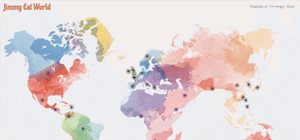

# Jimmy Eat World

#### Team week project for Epicodus, 07.06.2020

### By Kate Skorija, Allison Sadin, Christine Augustine, Megan Hepner

## Preview

## Description 

This application will allow the user to search recipes via an interactive map. The map will have clickable function over certain regions and once clicked, the user will be directed to recipes popular to that region of the world. 

## Specifications

**Behavior**: Program will display a map.
  * Input: User navigates to webpage
  * Output: Map is displayed

**Behavior**: When user clicks on a point, recipes from that region are displayed.
  * Input: User clicks map
  * Output: Recipe options are displayed

  **Behavior**: Populate div with recipe information and image, with an option to follow a link to the recipe listed.
  * Input: User clicks on a recipe
  * Output: User is redirected to the recipe page with cooking instructions

**Behavior**: Generate random recipe
 * Input: user clicks What's for Dinner button
 * Output: modal pops up with Random Recipe, title, and link to recipe

**Behavior**: Generate shopping list
 * Input: user clicks add to shopping list under each recipe photo
 * Output: ingredients from recipe are generated in shopping list div

## Setup/Installation Requirements

Software Requirements:

1.  Internet browser

2.  A code editor, such as Visual Studio Code, to view or edit the code base

To Open:

1.  Navigate to the [jimmy-eat-world respository](https://github.com/kate-skorija/jimmy-eat-world) or open your terminal

2. Clone this project using the GitHub button or the command:
`$ git clone https://github.com/kate-skorija/jimmy-eat-world.git`

3. Navigate to the `jimmy-eat-world` directory in your editor of choice, or use [Visual Studio Code](https://code.visualstudio.com/)

4. Navigate to [Spoonacular API](https://spoonacular.com/food-api) and create a free account to get an API key. 

5. Create a .env file in the root directory of the project, and save your new API key in this file like so: API_KEY = YOUR API KEY HERE.

6. Run the `npm install` command in your terminal to install webpack

7. Run the `npm run start` command to view the project in your browser 

## Known Bugs

There are no known bugs at this time.

## Support and Contact Details

If there are any issues or questions, please reach out through [my GitHub account](https://github.com/kate-skorija). 

## Technologies Used

*  [Visual Studio Code](https://code.visualstudio.com/)
*  [Markdown](https://daringfireball.net/projects/markdown/)
*  [HTML](https://developer.mozilla.org/en-US/docs/Web/Guide/HTML/HTML5)
*  [CSS](https://developer.mozilla.org/en-US/docs/Glossary/CSS)
*  [Bootstrap](https://developer.mozilla.org/en-US/docs/Glossary/Bootstrap)
*  [JavaScript](https://developer.mozilla.org/en-US/docs/Web/JavaScript)
*  [jQuery](https://developer.mozilla.org/en-US/docs/Glossary/jQuery)
*  [webpack](https://webpack.js.org/)
*  [Jest](https://jestjs.io/en/)
*  [Spoonacular API](https://api.spoonacular.com)

### License

*This project uses the following license: [MIT](https://opensource.org/licenses/MIT)*

Copyright (c) 2020 **_Kate Skorija, Allison Sadin, Christine Augustine, Megan Hepner_**